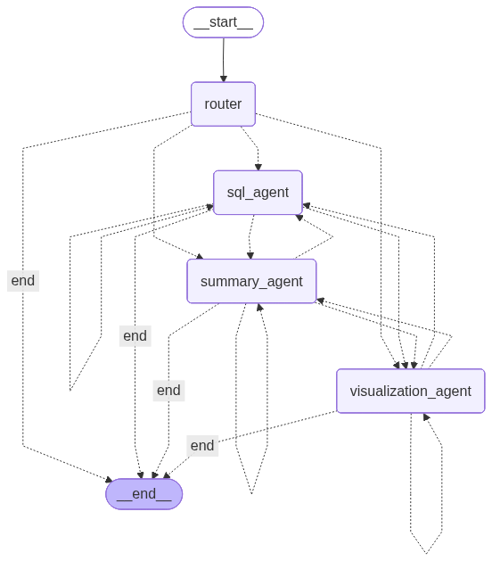
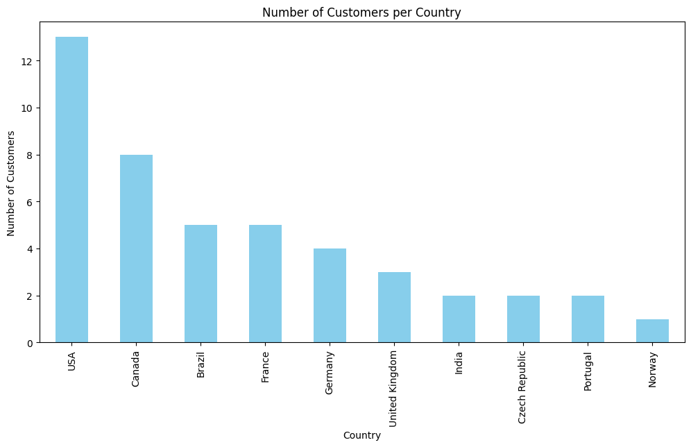
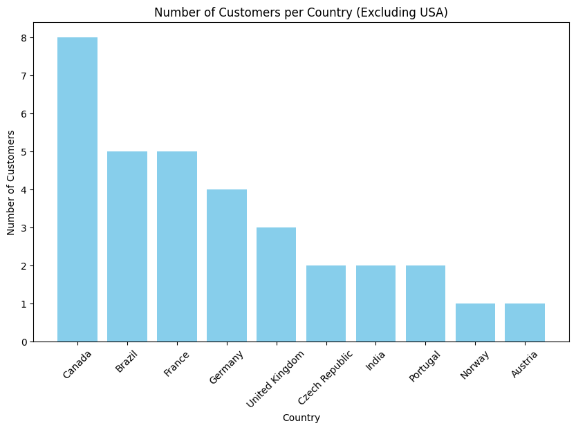

# Agentic Workspace 

A modular LLM-based operating system for data analysis tasks.  
It automatically interprets natural language requests and routes them to specialized agents such as SQL and visualization modules.

## Features

- **SQL Agent** – Executes natural language queries against structured databases.  
- **Visualization Agent** – Generates charts and plots automatically using LangChain’s pandas DataFrame agent. Automatically saves to plots folder.
- **Modular Architecture** – Easily extendable with new agent types or custom workflows.  
- **Context awareness** – Maintains up to the 10 most recent user–system interactions to preserve conversational continuity.
<p align="center">
  
  <br>
  <em>Figure 1: LangGraph workflow showing agent routing and execution flow.</em>
</p>


## Results

The Results Notebook demonstrates successful end-to-end execution of the agentic workflow using the Chinook database.
Key outcomes include:

- Correct routing of tasks between SQL, visualization, and summary agents.
- Automatic generation of SQL queries in response to natural language prompts.
- Automatic visualization of plots created directly from query outputs.
- Context-aware refinement of user requests (e.g., filtering results as  demonstrated in the Notebook).
<table>
  <tr>
    <td align="center" width="50%">
      <br>
      <em>Figure 2: Query — "Query the database for all customers and create a bar chart showing the number of customers per country, sorted in descending order."</em>
    </td>
    <td align="center" width="50%">
      <br>
      <em>Figure 3: Query — "Generate the same chart as in the previous request, but exclude the United States while keeping all other countries."</em>
    </td>
  </tr>
</table>

These results confirm that the Agentic Workspace can autonomously process user queries, generate data insights, and adapt based on conversational context.


## Setup

1. Clone the repository:
```bash
git clone <your-repo-url>
cd agentic-workspace
```

2. Install dependencies:
```bash
pip install -r requirements.txt
```

3. Configure environment variables:
Create a .env file with your API key and other configuration parameters as in **example.env** file:


## Project Structure:
<pre>
agentic-workspace/
│
├── agents/
│   ├── __init__.py
│   ├── sql_agent.py
│   └── visualization_agent.py
│
├── utils/
│   ├── __init__.py
│   ├── config.py
│   └── orchestrator.py
v
├── plots
│
├── main.py
├── Results Notebook.ipynb
├── requirements.txt
├── .env                   
└── README.md
</pre>


## Usage Examples (for relevant databases)
- "Plot a histogram of customer ages"
- "Query the database for top products"
- "Show summary statistics of sales data"
- "Create a scatter plot of price vs rating"


---

## Author

**Artur Garipov**  
[LinkedIn](https://www.linkedin.com/in/artur-garipov-paris) | [GitHub](https://github.com/Artur-Gar)
